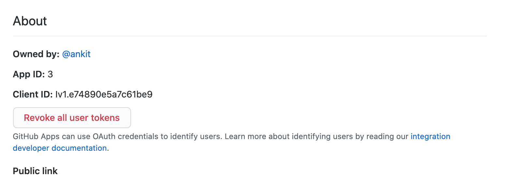

# On-premise Installation

We use docker images to support easy installation of Aviator on any cloud provider or privately hosted network. There are two ways to setup: using a docker compose file or using a k8 helm configuration.

## Using Docker Compose

### Minimum requirements for the Aviator server

* [x] 4 CPU
* [x] 8 GB memory
* [x] 25 GB storage

### Prerequisites

1. Ubuntu or Debian installation on the box.
2. Docker engine is installed. You can follow instructions [<mark style="color:blue;">here</mark>](https://docs.docker.com/engine/install/ubuntu/).
3. You have SSH access to the box.
4. A user with sudo permissions on the box.
5. You have access to the secrets file provided by Aviator.
6. You have the privilege to create a GitHub app and authorize the app for a repository.

### Limitations

* Google OAuth login does not work in on-prem setup

### Variable definitions

`github_url`: Hostname where GitHub is hosted

`av_hostname`: Hostname where Aviator is hosted (e.g. `aviator.example.com`)

`github_app_id`: ID generated when a GitHub app is created

`mergequeue.pem`: Private key generated by GitHub for Aviator

`av_box`: Represents the Linux box where Aviator server will be set up

### Step 1

Assign a valid <`av_hostname`> to the `av_box` on your DNS server. Depending on your DNS, this may take some time to propagate. Make sure the hostname resolves before moving on.

### Step 2

Go to GitHub Developer settings and Click “New GitHub App”. The developer settings can be found through your user settings or url of the format:

_https://\<github\_url>/settings/apps_

Use the following settings to create the app:

**GitHub App name:** Aviator

**Description:** Automate merge workflows for GitHub, manage queues in teams and improve code quality.

**Homepage URL:** [https://aviator.co/](https://aviator.co/)

**User authorization callback URL:** https://\<av\_hostname>/api/setup/complete

**Expire user authorization tokens**: YES

**Request user oauth**: NO

**Setup URL:** https://\<av\_hostname>/api/setup/complete

**Redirect on update**: YES

**Webhook**

**Active**: YES

**Webhook URL:** https://\<av\_hostname>/api/webhook

**Webhook Secret:** Optional. If you setup Webhook secret, you should also define set that at `GITHUB_WEBHOOK_SECRET` to validate webhook signature.

**Enable SSL verification**: YES

**Permissions:**


_**Please review the following carefully, any mismatch here could result in unexpected behavior of the app.**_


**Administrator**:  Read only

**Checks**: Read & Write

**Commit statuses**: Read & Write

**Contents**: Read & Write

**Issues**: Read & Write

**Metadata**: Read only

**Pull requests**: Read & Write

**Workflows**: Read & Write

**Members**: Read only

****

**Subscribe to events**:

Branch Protection rules

Check Run

Check Suite

Label

Issue Comments

Member

Public

Pull request

Pull request review

Pull request review comment

Push

Status

**Where can GitHub App be installed**: Any account

\<SAVE>

After creating the GitHub app, you can add a logo. Find a copy of Aviator Logo in the attached assets.

### Step 3

From the GitHub app page for Aviator, take a note of the App ID specified on the top. This is your _github\_app\_id_.



### Step 4

Additionally, you should generate a private key from the bottom of the page. This is your _mergequeue.pem_. Copy this file on the `av-box`. Also copy the `aviator.zip` file provided by the Aviator team.

### Step 5

Verify that docker engine exists, otherwise follow the instructions [<mark style="color:blue;">here</mark>](https://docs.docker.com/engine/install/ubuntu/) <mark style="color:blue;"></mark> to install.

### Step 6

Create _/opt/mergequeue/keys_ directory and copy the _mergequeue.pem_ file there.

```shell
$ sudo mkdir -p /opt/mergequeue/keys
$ sudo mv mergequeue.pem /opt/mergequeue/keys/
$ sudo chmod 0644 /opt/mergequeue/keys/mergequeue.pem
```

### Step 7

Extract the _mergequeue.zip_ file, and open _enterprise/install.sh_ in your favorite editor. You will need to insert the secrets on lines 5 to 25. Here are some details for each secret value:

| Value                                        | Description                                                                                                                                                              |
| -------------------------------------------- | ------------------------------------------------------------------------------------------------------------------------------------------------------------------------ |
| `AWS_ACCESS_KEY_ID`, `AWS_SECRET_ACCESS_KEY` | Provided in the secrets file, used to pull docker images.                                                                                                                |
| `LICENSE_KEY`                                | Provided in the secrets file.                                                                                                                                            |
| `CERT_EMAIL`                                 | Email used by LetsEncrypt. This is where you will get emails about expiring certificates. During our setup of LetsEncrypt certificate, we also enable auto-renewal cron. |
| `GITHUB_URL`                                 | Same as _github\_url_. This is only the hostname without any “https://” and any trailing slashes.                                                                        |
| `HOSTNAME`                                   | Same as `av_hostname`. This is only the hostname of Aviator server without any “https://” and any trailing slashes.                                                      |
| `GITHUB_APP_ID`                              | The same _github\_app\_id_ mentioned in Step 3.                                                                                                                          |
| `SUMO_ACCESS_ID`, `SUMO_ACCESS_KEY`          | We use SumoLogic for log tracking. These values should be provided to you in the keys.                                                                                   |

Save the file.

### Step 8

Once the configurations above are set, run the install script. This will pull, build and start all the docker containers required for the Aviator service.

```shell
$ ./install.sh
```

At the end of that script, it will run _docker-compose up -d_ to start the containers as detached. You can verify that the containers are running by:

```shell
$ sudo docker-compose ps
```

At this point, you should be able to open `av-hostname` in the browser.

### Step 9

Once the page loads, you can go and register a new account and follow the instructions. It will guide you to connect the GitHub Repository with the GitHub app you created. Once authorized, you should see the connected repositories on your Repository page.

Use the same account for all purposes. You can invite other team members to this account from the Users and Roles section.

### Troubleshooting

If the setup above fails, or docker fails to start containers, please reach out to the Aviator team. And share the output of install script along with logs from docker-compose:

```shell
$ sudo docker-compose logs
```

## Using k8 configuration

k8 configuration can be setup using similar steps. This is setup still in beta, contact us if you want to use k8 help charts for setup.
